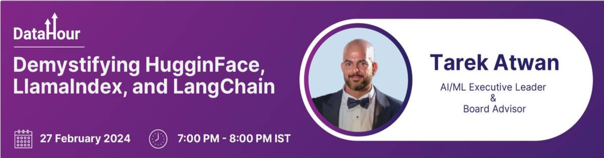

# Examples and Tutorials using LangChain, LLamaIndex, and HuggingFace

This is based on the 1-hour webinar titled “Demystifying Huggingface, LlamaIndex, and LangChian” delivered on February 27th via DataHour by Analytics Vidhya. 

[Link to the recording](https://community.analyticsvidhya.com/c/datahour/demystifying-hugginface-llamaindex-and-langchain)

